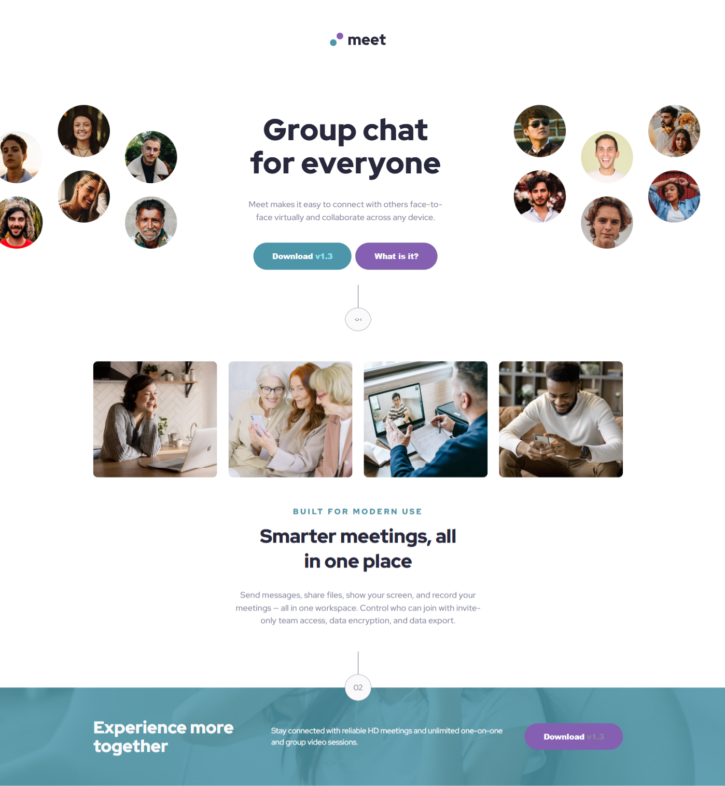

# Frontend Mentor - Meet landing page solution

This is a solution to the [Meet landing page challenge on Frontend Mentor](https://www.frontendmentor.io/challenges/meet-landing-page-rbTDS6OUR). Frontend Mentor challenges help you improve your coding skills by building realistic projects. 

## Table of contents

- [Overview](#overview)
  - [The challenge](#the-challenge)
  - [Screenshot](#screenshot)
  - [Links](#links)
- [My process](#my-process)
  - [Built with](#built-with)
  - [What I learned](#what-i-learned)
  - [Continued development](#continued-development)
  - [AI Collaboration](#ai-collaboration)
- [Author](#author)


## Overview

### The challenge

Users should be able to:

- View the optimal layout depending on their device's screen size
- See hover states for interactive elements

### Screenshot




### Links

- Solution URL: [https://github.com/Iyanu22/meet-landing-page]
- Live Site URL: [https://iyanu22.github.io/meet-landing-page/]

## My process

### Built with

- Semantic HTML5 markup
- SCSS
- Flexbox
- CSS Grid
- Mobile-first workflow

### What I learned
This project deepened my understanding of responsive layout beyond just writing the CSS — a lot of the real learning came from debugging why styles weren't applying as expected. Specific things I now understand much better:

CSS specificity — how nested selectors compile to compound selectors with cumulative specificity, and why a "later" rule in a stylesheet doesn't always win if an earlier rule is more specific.
max-width inheritance — a child element can never exceed a max-width set on its parent, no matter what width you give the child directly. Debugging "why isn't my max-width working" almost always means checking ancestors first.
The full-bleed 100vw technique — using ```width: 100vw``` with ```left: 50% ```and negative margins to break an element out of a constrained container, plus the scrollbar-width edge case that can introduce.
Flexbox sizing quirks — flex items don't shrink below their content's intrinsic size by default ```(min-width: auto),``` which caused unexpected overflow until I explicitly set ```min-width: 0``` and ```flex: 1 together```.
I also got much more comfortable moving fluidly between Grid and Flexbox depending on the layout need — using Grid for the hero image/text areas and Flexbox for horizontally distributed rows like the footer.

### Continued development
More practice building responsive layouts across various breakpoints and devices, particularly getting faster at translating Figma spacing/sizing values into CSS without repeated trial and error
Building a better mental checklist for debugging layout issues (specificity, cascading widths, flex sizing) before jumping straight to guessing.

### AI Collaboration

I used Claude throughout this project to debug layout issues, understand why certain CSS behaviors occurred (not just get a fix), and talk through responsive design decisions across breakpoints.

## Author

- Website - [GitHub](https://github.com/Iyanu22/meet-landing-page)
- Frontend Mentor - [@Iyanu22](https://www.frontendmentor.io/profile/Iyanu22)
